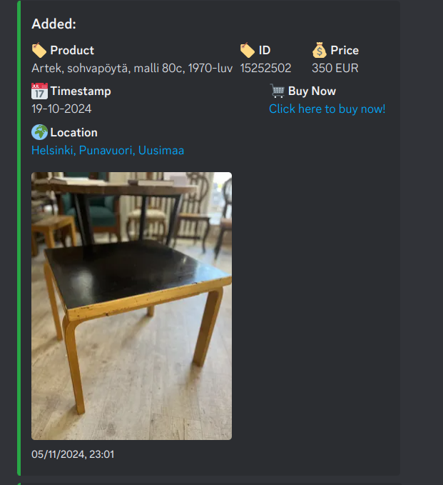
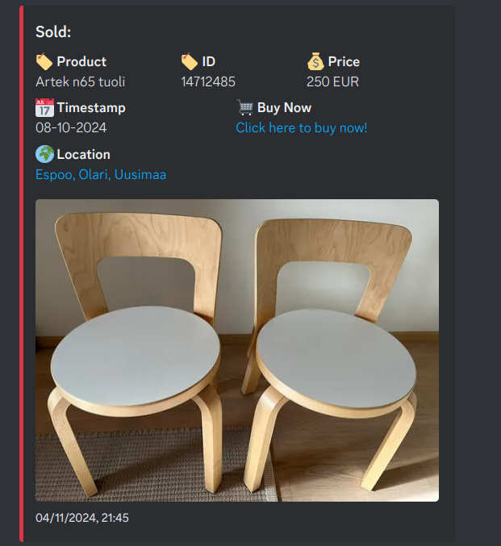
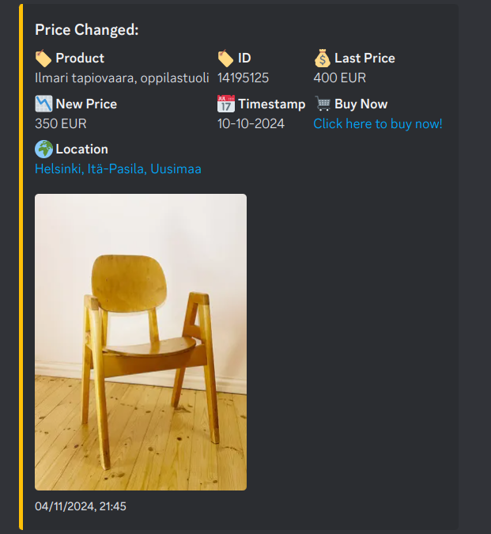

# tori_bot_monitor

This is a repository for the tori_bot_monitor project.

**Description:**

* This monitor helps you keep track of the products you're interested in. It automatically checks for price changes and availability updates on the finnish website https://www.tori.fi.

* It can store the products in a mongo db dataset, and will scrape and compare the products each 5 minutes.


**Notifications**

I am using Discord as message platform and DiscordWebhooks to manage the webhooks. The bot have 3 types of otifications:

* Added: 


* Sold: 


* Price Change:


**Database Structure**

Each of the database entry will be stored following the format:
```json
{
  "id": "",
  "title": "",
  "location": "",
  "price": {
    "$numberInt": ""
  },
  "currency": "EUR",
  "image": "",
  "timestamp": "",
  "coords": {
    "lat": {
      "$numberDouble": ""
    },
    "lon": {
      "$numberDouble": ""
    }
  },
  "url": "",
  "image_urls": [
    ""
  ],
  "trade_type": ""
}
```

**Env**
```env
username= mongodb username
password= mongodb password
COLLECTION_NAME=
DATABASE_NAME=
MONGO_CLUSTER=
DISCORD_WEBHOOK_URL= 
DISCORD_BOT_TOKEN=
```


**Contact:**

* alejandro.fernandezarmas@gmail.com

